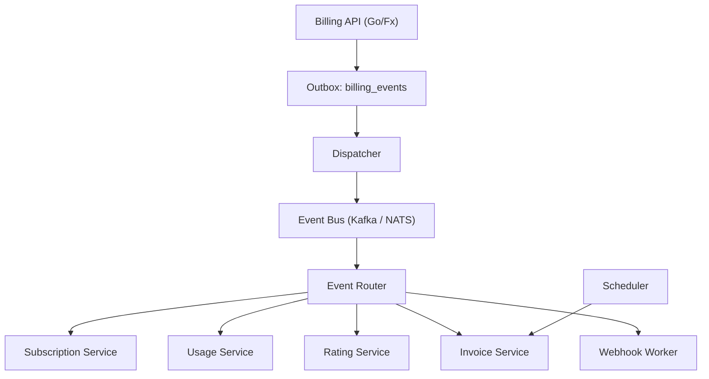

# CoreBilling BEaaS

  

**Tagline:** Event-driven, multi-tenant billing orchestrated via Go, SQLC, Uber/Fx, and resilient delivery primitives.

## Executive Summary

CoreBilling BEaaS transforms billing operations into a distributed event mesh. Services emit canonical `billing_events` through an Outbox, dispatchers publish to Kafka/NATS, the router executes domain handlers, and follow-up events trigger invoicing, ledgers, retries, and webhooks. Multi-tenancy is baked in via `tenant_id` guardrails, HMAC-secured webhook deliveries, and per-tenant metrics.

## Architecture Diagram



## Key Modules

- **Billing API:** gRPC/HTTP entrypoint handling subscriptions, plans, usage, and tenant metadata via SQLC.
- **Subscription Engine:** Validates lifecycle, manages trials and renewals, emits `subscription.*` events.
- **Usage Metering:** Stores raw meter data, enforces idempotency, and forwards rated events.
- **Rating Engine:** Calculates charges, emits `rating.completed`, and seeds invoices.
- **Invoice Engine:** Aggregates items, transitions invoices through `draft -> open -> paid`, and publishes `invoice.*`.
- **Outbox Dispatcher:** Polls `billing_events`, publishes envelopes, retries with backoff, moves DLQ entries.
- **Event Router:** Subscribes to Kafka/NATS, executes handlers in Fx lifecycle, attaches tracing metadata.
- **Webhook Engine:** Tenant-configurable webhooks with HMAC signing, retries, DLQ, and Prometheus metrics.
- **Scheduler:** Closes billing cycles, triggers invoices, and surfaces `billing.cycle.closed`.

## Quickstart

### Run Locally

```bash
docker-compose up -d postgres kafka nats
make migrate
docker-compose run --rm corebilling
```

### Run Unit Tests

```bash
go test ./internal/...
```

### Run Integration Tests

```bash
go test ./internal/events
```

### Observability

- Traces: `OTLP_ENDPOINT` defaults to `localhost:4317`. Run `otelcol` collector.
- Metrics: `/metrics` exposes Prometheus counters (outbox dispatch, webhook delivery). Alert on `corebilling_webhook_delivery_dlq_total` or `corebilling_outbox_dispatcher_errors`.

## Developer Guides

### Adding a New Event Type

1. Define subject/payload in `docs/event-catalog.md`.
2. Create gRPC handler reproduction or new domain state machine emitting the event with metadata.
3. Add migration if new tables required and update SQLC queries.
4. Register handler with `events.Router`.

### Adding a New Handler

1. Implement `events.Handler` interface under `internal/events/handler/<domain>`.
2. Ensure idempotency via `outbox.IdempotencyTracker`.
3. Publish follow-up events via `events.Publisher`.
4. Register handler through Fx provider group (`providers.Module`).

### Debugging Event Flows

1. Inspect `billing_events` for payload/metadata.
2. Watch dispatcher logs for publish success/failure.
3. Use `otelcol` traces to follow subject spans.
4. Check webhook tables for delivery attempts.

## Documentation Index

- [Overview](docs/overview.md)  
- [Architecture](docs/architecture.md)  
- [Event Catalog](docs/event-catalog.md)  
- [Outbox Pattern](docs/outbox-pattern.md)  
- [Event Pipeline](docs/event-pipeline.md)  
- [Webhooks](docs/webhooks.md)  
- [Scheduler](docs/scheduler.md)  
- [Quota](docs/quota.md)  
- [Public API](docs/public-api.md)  
- [Replay Engine](docs/replay-engine.md)  
- [Operations](docs/operations.md)  
- [Deployment](docs/deployment.md)  
- [Onboarding](docs/onboarding.md)

## Production Readiness

- **Multi-tenant safety:** `tenant_id` required on every command and payload; SQLC queries index per tenant.
- **Observability:** OpenTelemetry traces, Prometheus counters (webhook and outbox), structured Zap logs.
- **Resilience:** Outbox + dispatcher ensures at-least-once delivery; webhook DLQ provides durability.
- **Security:** API keys managed via Vault, webhook secrets HMAC-signed, and ingress rate limiting.
