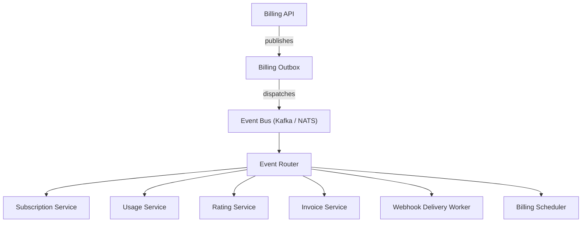
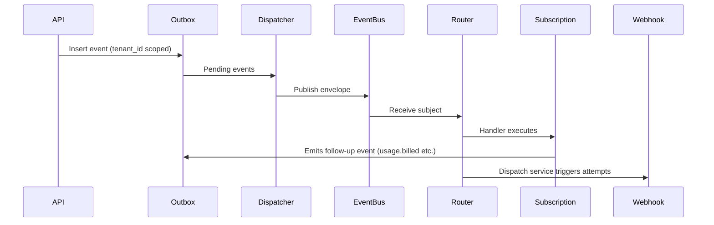

# Architecture

## C4: System Context

## Container Architecture

- **Billing API Container:** Hosts gRPC/HTTP frontends, SQLC-based repositories, and Uber/Fx module wiring. Responsible for handling synchronous tenants requests (plans, subscriptions, usage ingestion) and persists corresponding events to the Outbox.
- **Outbox Dispatcher Container:** Reads `billing_events`, publishes to the event bus, tracks retries/DLQ state.
- **Event Router Container:** Subscribes to Kafka/NATS topics, executes handlers, and emits follow-up events through the Outbox, maintaining correlation IDs.
- **Webhook Delivery Worker Container:** Polls webhook attempt tables, sends signed payloads, retries on failure, respects tenant configuration, writes to DLQ.
- **Scheduler Container:** Closes billing cycles, generates invoices, and emits `billing.cycle.closed` events.
- **Replay Engine Container:** Provides CLI/gRPC-driven replay operations with safety checks, ensures idempotency by leveraging correlation/causation metadata.

## Component Architecture

1. **Outbox.Persistence:** A SQLC-generated repository writing to `billing_events`, with metadata fields updated by `ExtractMetadata` helpers.
2. **Dispatcher:** Shares an `events.Publisher` interface backed by Kafka/NATS/Noop, publishes prepared envelopes and updates metadata (status/retry).
3. **Router:** Maintains handler registry by subject. Each handler (subscription.created, usage.reported, etc.) validates idempotency (`outbox.IdempotencyTracker`), manipulates domain state, and triggers follow-up events.
4. **State Machines:** Subscription, Usage, and Invoice domain packages expose `ApplyLifecycle` that validates transitions and emits `eventv1.Event` with structured payloads (status, IDs).
5. **Webhook Delivery:** Includes SQL tables (`webhooks`, `webhook_delivery_attempts`, `webhook_dlq`), repository interface, service to enqueue deliveries, worker that signs/dispatches HTTP POSTs with exponential backoff and metrics instrumentation.
6. **Scheduler & Replay:** Scheduler reads cycles, generates invoice events, and enqueues them through Outbox; the replay module can reprocess archived events while preserving idempotency metadata.

## Event Flow Diagrams

## Bounded Contexts

- **Subscription Context:** Manages lifecycle (created, trial, active, canceled). Handlers update SQLC models, enforce `customer_id`, `price_id`, and emit `subscription.status.changed`.
- **Usage Context:** Records meter data, enforces idempotency per `idempotency_key`, and emits `usage.rated` events for rating.
- **Rating Context:** Calculates charges, produces `rating.completed` or `rating.failed`, and feeds invoice generation.
- **Invoice Context:** Aggregates rated usage/invoice items, transitions statuses via the state machine (`draft`, `open`, `paid`, `void`), and publishes `invoice.generated`/`invoice.status.changed`.
- **Webhook Context:** Subscriptions stored per tenant, HMAC secrets, handles exponential backoff/DLQ, and ensures deliveries honor tenant scoping.
