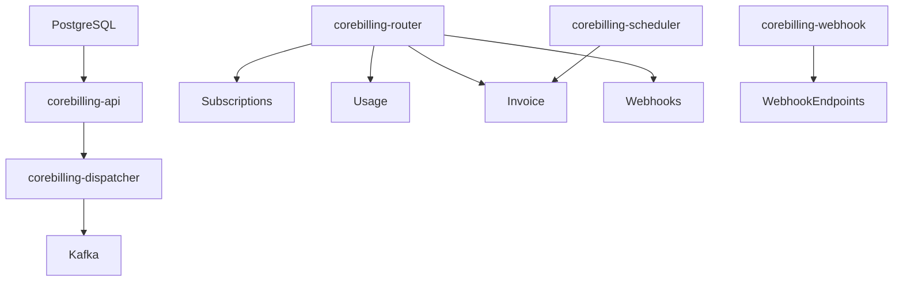

# Deployment

## Nomad Job Structure

- `corebilling-api`: Runs gRPC/HTTP servers, DB migrations, and Fx modules.
- `corebilling-dispatcher`: Runs the outbox dispatcher and scheduler workers.
- `corebilling-webhook`: Dedicated webhook worker for signed deliveries.
- `corebilling-router`: Hosts Kafka/NATS router for event handlers.

Each job defines task groups per region; PostgreSQL connection strings configured via environment variables and injected into Vault.

## Consul Services

- Register `corebilling-api`, `corebilling-dispatcher`, `corebilling-router`, and `corebilling-webhook` in Consul for service discovery.
- Use health checks hitting `/ready` and `/healthz` from the HTTP server.

## Vault AppRole Integration

- API keys, webhook secrets, and `DATABASE_URL` are stored in Vault.
- Each job pulls secrets at startup via AppRole and writes them to `.env` or environment overrides.

## Service Mesh / Gateway Notes

- Deploy an ingress gateway (e.g., Traefik) to route public APIs.
- Kafka/NATS traffic can traverse the service mesh if using mTLS, but router and dispatcher rely on direct connections for throughput.
- Sidecars may expose metrics on `/metrics` scraped by Prometheus.

## Environment Variable Matrix

| Variable | Purpose | Default |
| --- | --- | --- |
| `DATABASE_URL` | PostgreSQL DSN | `postgres://...` |
| `ENABLED_MIGRATION_SERVICES` | Services to migrate | `audit,...,webhook,ledger` |
| `OTLP_ENDPOINT` | OpenTelemetry collector | `localhost:4317` |
| `WEBHOOK_WORKER_INTERVAL_SECONDS` | Poll interval | `30` |
| `WEBHOOK_MAX_RETRIES` | Delivery retry cap | `5` |
| `WEBHOOK_HTTP_TIMEOUT_SECONDS` | HTTP timeout | `15` |
| `KAFKA_BROKERS` | Kafka bootstrap | `kafka:9092` (if enabled) |
| `NATS_URL` | NATS endpoints | `nats://nats:4222` |

## Production Topology

