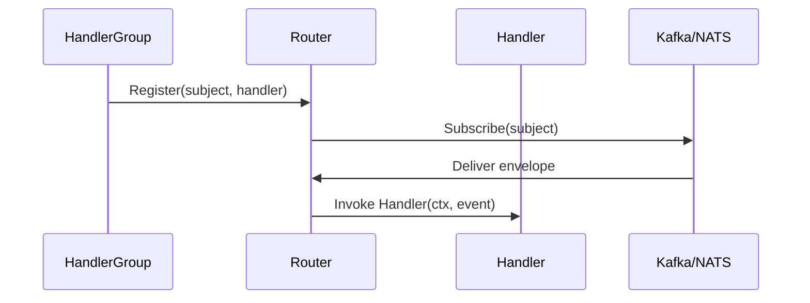

# Event Pipeline

## Router Architecture

`events.Router` holds a map of subjects → handlers. Each handler registers via Fx with `handler.HandlerOut` and is invoked under `events.Router.Start`. The router wraps handlers with OpenTelemetry spans, injects correlation context, and logs event subjects.

## Handler Lifecycle

1. Handler receives `events.Event`.
2. Idempotency tracker rejects duplicates (`seenBefore`).
3. Handler builds domain command object, e.g., `usage.Reported` or `subscription.Subscription`.
4. Domain service updates repository, potentially invoking `ApplyLifecycle`.
5. Handler publishes follow-up events through the shared `events.Publisher`.

## Billing Event Pipeline

1. **UsageReported:** Handler writes usage records and emits `usage.rated`.
2. **RatedUsage:** Handler triggers invoice generation by publishing `invoice.generated`.
3. **InvoiceItemAdded:** Invoice service aggregates rated usage items and keeps invoice state.
4. **InvoiceGenerated:** Handler persists invoice, publishes ledger entries, and optionally triggers webhooks.

## State Machines

- **Subscription:** Valid transitions include `created -> trialing -> active` and `active -> canceled`. Invalid transitions error out (`ErrInvalidSubscriptionTransition`).
- **Usage:** States `reported -> rated -> billed`, enforced inside `UsageRecord.ApplyLifecycle`.
- **Invoice:** Lifecycle moves through `draft`, `open`, `paid`, `void`, and emits `invoice.status.changed`.

These machines ensure business rules even in replay scenarios.
